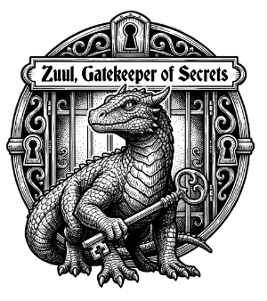

# Zuul

[](https://github.com/farmisen/zuul/actions/workflows/ci.yml)
[](https://sonarcloud.io/summary/new_code?id=farmisen_zuul)
[](LICENSE)
<p align="center">
  
</p>

> *"Are you the Keymaster?"* — Zuul, Ghostbusters (1984)

A CLI tool for managing secrets across multiple environments, with pluggable backend storage.


## Features

- **Multi-environment** — Manage secrets across `dev`, `staging`, `production`, and any custom environments
- **Pluggable backends** — GCP Secret Manager for teams, encrypted local file for solo/offline use
- **Export formats** — Output secrets as dotenv, direnv, JSON, YAML, or shell exports
- **Run with secrets** — Inject secrets into any subprocess via `zuul run`
- **Import** — Bulk-import from `.env`, JSON, or YAML files
- **Local overrides** — Override backend values locally via `.zuul.local.toml` (never leaves your machine)
- **Metadata** — Attach key-value metadata (owner, rotate-by, description) to secrets
- **Crash recovery** — Batch operations are journaled; `zuul recover` resumes interrupted work

## Available Backends

| Backend | Config `type` | Best for | Docs |
|---------|--------------|----------|------|
| **File** | `file` | Local dev, small projects, offline use | [backend-file.md](docs/backend-file.md) |
| **GCP Secret Manager** | `gcp-secret-manager` | Teams, CI/CD, IAM-based access control | [backend-gcp.md](docs/backend-gcp.md) |

## Quick Start

### File backend (zero dependencies)

```bash
cargo install --path .

zuul init --backend file
# Choose: identity file (recommended) or passphrase

zuul env create dev
zuul secret set DATABASE_URL --env dev "postgres://localhost/mydb"
zuul run --env dev -- cargo run
```

### GCP backend

```bash
cargo install --path .

# Provision infrastructure
cd terraform
cp terraform.tfvars.example terraform.tfvars  # edit with your values
terraform init && terraform apply
cd ..

# Initialize and authenticate
zuul init --project my-gcp-project-123
zuul auth

# Manage secrets (environments created by Terraform)
zuul secret set DATABASE_URL --env dev "postgres://localhost:5432/mydb"
zuul run --env dev -- cargo run
```

## Configuration

### `.zuul.toml`

Created by `zuul init`. Committed to version control.

**File backend:**
```toml
[backend]
type = "file"

[defaults]
environment = "dev"
```

**GCP backend:**
```toml
[backend]
type = "gcp-secret-manager"
project_id = "my-gcp-project-123"

[defaults]
environment = "dev"
```

### `.zuul.local.toml`

Local overrides for development. Added to `.gitignore` automatically.

```toml
[secrets]
DATABASE_URL = "postgres://localhost:5432/mydb_local"
REDIS_URL = "redis://localhost:6379"
```

Local overrides from `.zuul.local.toml` are not applied by default. Use `--overrides` with `zuul export` or `zuul run` to merge them.

## direnv Integration

Add this to your `.envrc` for automatic secret loading:

```bash
eval "$(zuul export --env dev --export-format direnv)"
```

See [`.envrc.example`](.envrc.example) for a ready-to-use template.

## Commands

| Command | Description |
|---------|-------------|
| `zuul init` | Initialize a new project |
| `zuul auth` | Set up backend authentication |
| `zuul env list\|create\|show\|update\|delete\|copy\|clear` | Manage environments |
| `zuul secret list\|get\|set\|delete\|info\|copy` | Manage secrets |
| `zuul secret metadata list\|set\|delete` | Manage secret metadata |
| `zuul export` | Export secrets in various formats |
| `zuul run` | Run a command with secrets injected |
| `zuul import` | Bulk-import secrets from a file |
| `zuul diff` | Compare secrets between two environments |
| `zuul recover status\|resume\|abort` | Inspect or resume incomplete batch operations |
| `zuul deploy fly` | Deploy to Fly.io with secrets synced and injected |
| `zuul sync netlify` | Sync secrets to Netlify's environment variables |
| `zuul sync fly` | Sync secrets to Fly.io |
| `zuul completions <shell>` | Generate shell completions (bash, zsh, fish, etc.) |

Use `zuul --help` or `zuul <command> --help` for details.

**Note:** `env create/update/delete` work directly with the file backend. For GCP, environments are managed by Terraform — these commands return an error directing you to `terraform apply`.

## Environment Variables

**Common (all backends):**

| Variable | Description |
|----------|-------------|
| `ZUUL_DEFAULT_ENV` | Override default environment name |
| `ZUUL_BACKEND` | Override backend type |

**File backend:**

| Variable | Description |
|----------|-------------|
| `ZUUL_KEY_FILE` | Path to an age identity file (recommended) |
| `ZUUL_PASSPHRASE` | Passphrase for scrypt-based encryption (fallback) |

**GCP backend:**

| Variable | Description |
|----------|-------------|
| `ZUUL_GCP_PROJECT` | Override GCP project ID |
| `ZUUL_GCP_CREDENTIALS` | GCP service account key: file path or inline JSON |

**Resolution order** (highest priority first): CLI flags → environment variables → `.zuul.local.toml` (secrets only) → `.zuul.toml` → built-in defaults.

## Development

```bash
# Build
cargo build

# Lint and format
cargo clippy -- -D warnings
cargo fmt
```

### Running Tests

**Unit and file-backend tests** run without any external dependencies:

```bash
cargo test
```

**GCP emulator tests** run against a GCP Secret Manager emulator:

```bash
# Start the emulator
docker compose -f docker-compose.emulator.yml up -d

# Run the GCP integration suite
cargo test --test gcp_emulator -- --ignored

# Stop the emulator when done
docker compose -f docker-compose.emulator.yml down
```

## Documentation

- [Software Requirements Specification](docs/zuul-spec.md)
- [File Backend](docs/backend-file.md)
- [GCP Backend](docs/backend-gcp.md)
- [Terraform Module](terraform/README.md)
- [Environment Admin Playbook](docs/gcp-env-playbook.md) (GCP)

## License

[MIT](LICENSE)
